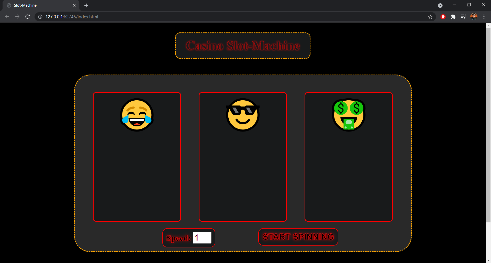
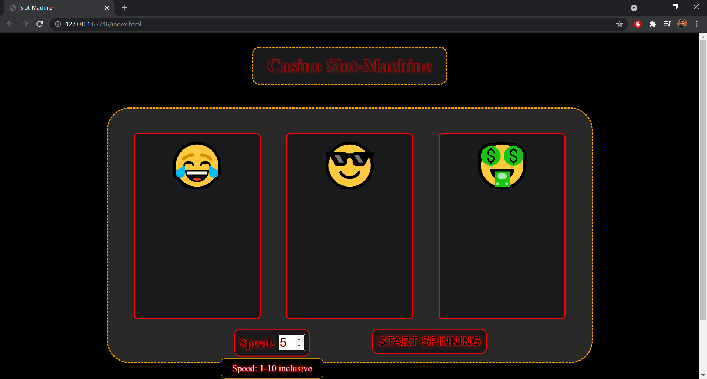
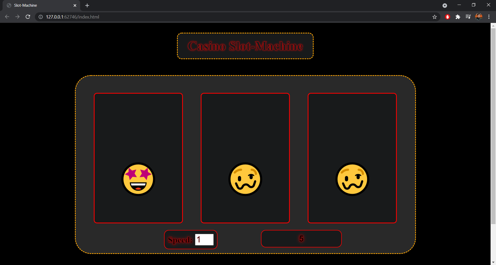
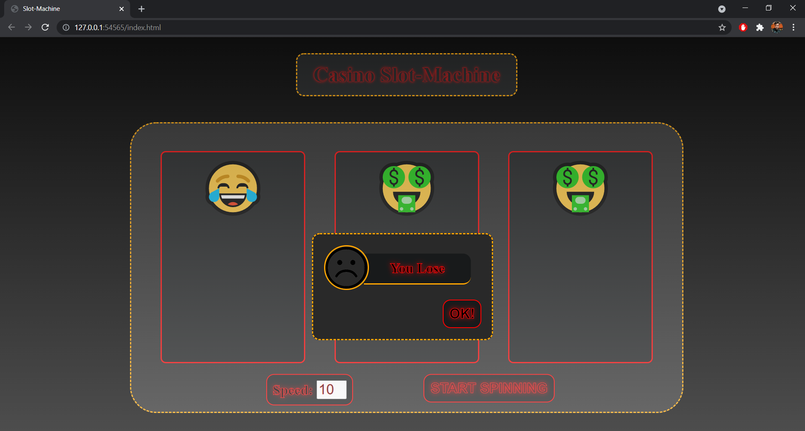

# CasinoSlotMachine-WebApp

This is a simple Casino Slot-Machine web application, made using HTML, CSS and Javascript.  
Rules:  
&emsp; 1. Select the Movement speed.  
&emsp; 2. Click on "START SPINNING" button.  
&emsp; 3. And Enjoy!! 

Check this out: **[Click Here](https://sumanksah.github.io/Casino_Slot_Machine-WebApp/)**

### Sample Images:

   
   
   
   

### Enjoy!!
